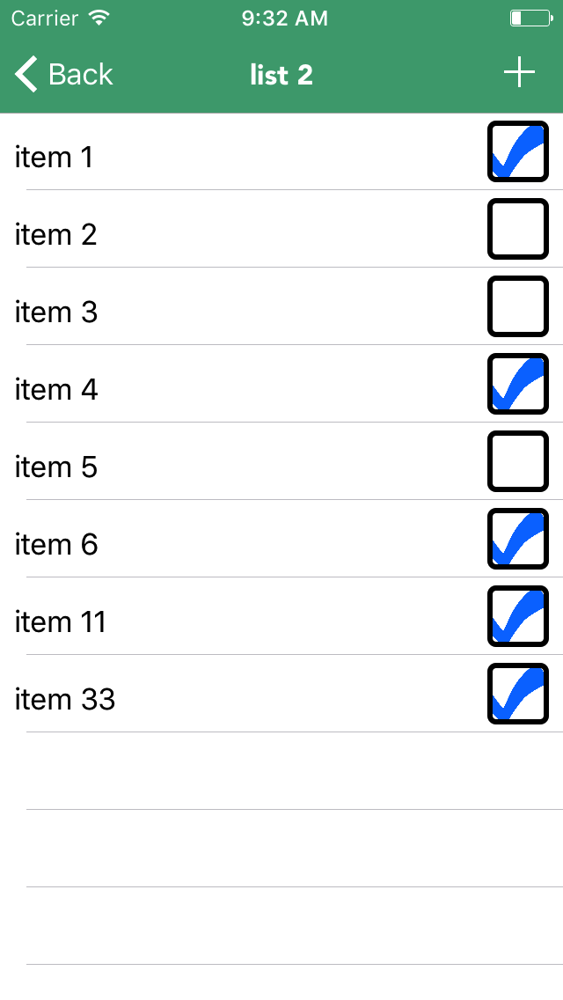
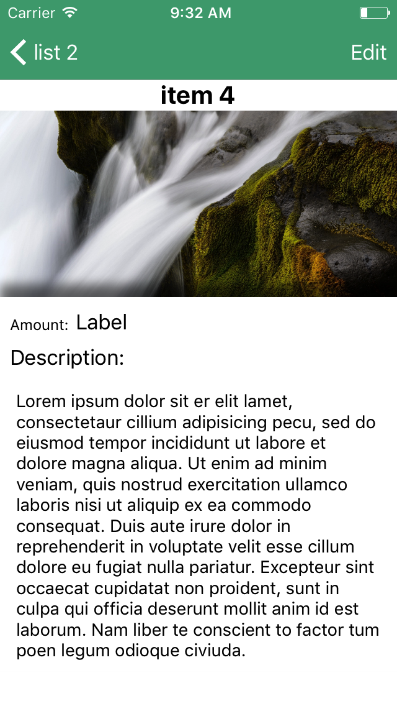

# Grocr

Grocr is my test project. The idea and initial implementation was taken from a nice [Firebase for iOS tutorial](https://www.raywenderlich.com/139322/firebase-tutorial-getting-started-2) from RayWenderlich. Current version is capable of retrieving/adding/deleting entries from firebase database. Sign up/in/out functional is also present. I plan to make it look more like a real grocery app with different lists, sections and item detail page and at the same time being user-friendly.

I will modify the code according to the MVVM architectural pattern in order to reduce tangelling and scattering and also to increase reusability. Another advantage of this pattern is that is helps to separate the concerns between the components. 
One important thing is the way to bind the UI elements to the view model, as it should not contain any UI code. One way of doing this would be to use closures in the view model and call them whenever the user manipulates with the UI. However, there is a better way - 
Functional Reactive Programming (FRP). Reactive programming brings us stream of data, on which we may attach listeners and hadle each change. Functional part in FRP stands for the higher-order functions like map and reduce that allow us to manipulate the data being passed through the stream. Basically, FRP gives a mutable collection, that may change dynamically and provides means to react to these changes. 
I have chosen the RxSwift FRP library in combination with RxCocoa, that implements the UI bindings.

Landing page | List of Groceries | Grocery | Grocery item 
:-------------------------:|:-------------------------:|:-------------------------:|:-------------------------:
  |   |  |   
