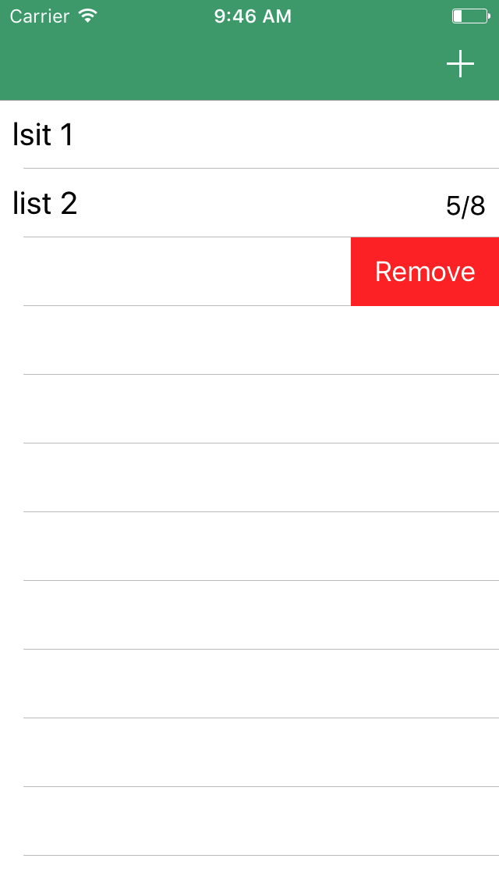

# Grocr

Grocr is my test project. The idea and initial implementation was taken from a nice [Firebase for iOS tutorial](https://www.raywenderlich.com/139322/firebase-tutorial-getting-started-2) from RayWenderlich. Current version is capable of retrieving/adding/deleting entries from firebase database. Sign up/in/out functional is also present. I plan to make it look more like a real grocery list app with different lists, sections and item detail page and at the same time being user-friendly.

Landing page | The list
:-------------------------:|:-------------------------:
  |   
